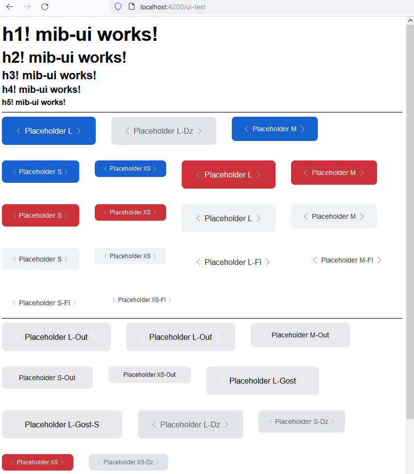
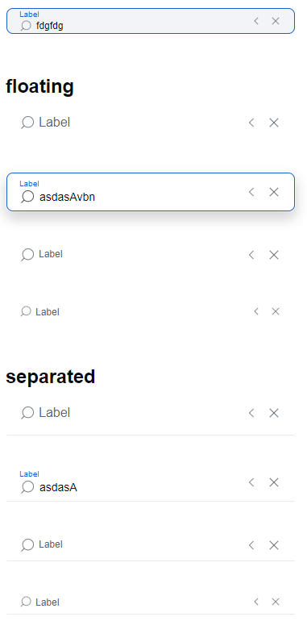

```js
// add i
ng g i shared/ui-kit/button/interfaces/button.interface --dry-run
// add comp
ng g c shared/ui-kit/button/button --flat --skip-tests --dry-run
// add m
ng g m shared/ui-kit/button --dry-run
// add accepting component module
ng g m shared/modules/mib-ui --dry-run

```

P




// input

```js
// add i
 ng g i shared/ui-kit/input/interfaces/input.interface --dry-run
 ng g i shared/ui-kit/badge/interfaces/badge.interface --dry-run
 ng g i shared/ui-kit/checkbox/interfaces/checkbox.interface --dry-run
 ng g i shared/ui-kit/tag/interfaces/tag.interface --dry-run
 ng g i shared/ui-kit/radio/interfaces/radio.interface --dry-run
 ng g i shared/ui-kit/switch/interfaces/switch.interface --dry-run
// add comp
 ng g c shared/ui-kit/input/input --flat --skip-tests --dry-run
 ng g c shared/ui-kit/badge/badge --flat --skip-tests --dry-run
 ng g c shared/ui-kit/checkbox/checkbox --flat --skip-tests --dry-run
 ng g c shared/ui-kit/radio/radio --flat --skip-tests --dry-run // fx update parent module
 ng g c shared/ui-kit/switch/switch --flat --skip-tests --dry-run // fx update parent module
 ng g c shared/ui-kit/tag/tag --flat --skip-tests --dry-run
 ng g c shared/ui-kit/input/components/autocomplete --flat --skip-tests --dry-run

 //--- add header module
src\app\shared\modules\header\header.component.html
ng g m shared/modules/header/header --flat --dry-run
 //---

 //--- add request-create-success-modal
src\app\client\modules\requests\modules
ng g m client/modules/requests/modules/request-create-success-modal --dry-run
ng g c client/modules/requests/modules/request-create-success-modal/request-create-success-modal --flat --skip-tests --dry-run
ng g s client/modules/requests/modules/request-create-success-modal/request-create-success-modal --skip-tests --dry-run
 //---

 //--- new-documents-page
src\app\client\modules\documents\pages
ng g m client/modules/documents/pages/new-documents-page/new-documents-page --flat --dry-run
ng g c client/modules/documents/pages/new-documents-page/new-documents-page --flat --skip-tests  --dry-run
 //---

 //--- new-contracts-page
src\app\client\modules\contracts\pages
ng g c client/modules/contracts/pages/new-contracts-page/new-contracts-page --flat --skip-tests  --dry-run
ng g s client/modules/contracts/services/contacts  --dry-run
 //---

 //--- new-documents-page-drawer
src\app\client\modules\documents\modules
ng g m client/modules/documents/modules/new-documents-page-drawer/new-documents-page-drawer --flat --dry-run
ng g c client/modules/documents/modules/new-documents-page-drawer/new-documents-page-drawer --flat --skip-tests  --dry-run
ng g s client/modules/documents/modules/new-documents-page-drawer/new-documents-page-drawer --flat --skip-tests  --dry-run
ng g i client/modules/documents/modules/new-documents-page-drawer/interfaces/new-documents-page-drawer.interface --dry-run
 //---

 //--- new-contracts-page-drawer
src\app\client\modules\contracts\modules
ng g m client/modules/contracts/modules/new-contracts-page-drawer/new-contracts-page-drawer --flat --dry-run
ng g c client/modules/contracts/modules/new-contracts-page-drawer/new-contracts-page-drawer --flat --skip-tests  --dry-run
ng g s client/modules/contracts/modules/new-contracts-page-drawer/new-contracts-page-drawer --flat --skip-tests  --dry-run
ng g i client/modules/contracts/modules/new-contracts-page-drawer/interfaces/new-contracts-page-drawer.interface --dry-run
 //---

 //--- new-documents-views-drawer
src\app\client\modules\documents\modules
ng g m client/modules/documents/modules/new-documents-views-drawer/new-documents-views-drawer --flat --dry-run
ng g c client/modules/documents/modules/new-documents-views-drawer/new-documents-views-drawer --flat --skip-tests  --dry-run
ng g s client/modules/documents/modules/new-documents-views-drawer/new-documents-views-drawer --flat --skip-tests  --dry-run
ng g i client/modules/documents/modules/new-documents-views-drawer/interfaces/new-documents-views-drawer.interface --dry-run
 //---

 //--- new-demand
src\app\shared\modules\new-demand
ng g m shared/modules/new-demand/new-demand --flat --dry-run
ng g i shared/modules/new-demand/interfaces/new-demand.interface --dry-run
ng g c shared/modules/new-demand/new-demand --flat --skip-tests  --dry-run
 //---

 //--- new-delays
 src\app\client\modules\delays\pages\new-delays
ng g m client/modules/delays/pages/new-delays/new-delays --flat --dry-run
ng g i client/modules/delays/pages/new-delays/interfaces/new-delays.interface --dry-run
ng g c client/modules/delays/pages/new-delays/new-delays --flat --skip-tests  --dry-run
 //---

 //--- new-delays-drawer
 src\app\client\modules\delays\modules\new-delays-drawer
ng g m client/modules/delays/modules/new-delays-drawer/new-delays-drawer --flat --dry-run
ng g i client/modules/delays/modules/new-delays-drawer/interfaces/new-delays-drawer.interface --dry-run
ng g s client/modules/delays/modules/new-delays-drawer/new-delays-drawer --skip-tests  --dry-run
ng g c client/modules/delays/modules/new-delays-drawer/new-delays-drawer --flat --skip-tests  --dry-run
 //---

 //--- demand-drawer
src\app\client\modules\demand-new\modules\demand-drawer
ng g i client/modules/demand-new/modules/demand-drawer/interfaces/demand-drawer.interface  --dry-run
ng g m client/modules/demand-new/modules/demand-drawer/demand-drawer --flat --dry-run
ng g s client/modules/demand-new/modules/demand-drawer/demand-drawer --skip-tests --dry-run
ng g c client/modules/demand-new/modules/demand-drawer --skip-tests --dry-run
 //---

 //--- demand-signature-drawer
src\app\client\modules\demand-new\modules\demand-signature-drawer
ng g i client/modules/demand-new/modules/demand-signature-drawer/interfaces/demand-signature-drawer.interface  --dry-run
ng g m client/modules/demand-new/modules/demand-signature-drawer/demand-signature-drawer --flat --dry-run
ng g s client/modules/demand-new/modules/demand-signature-drawer/demand-signature-drawer --skip-tests --dry-run
ng g c client/modules/demand-new/modules/demand-signature-drawer --skip-tests --dry-run
 //---

 //--- demand-surety-drawer
src\app\client\modules\demand-new\modules\demand-surety-drawer
ng g i client/modules/demand-new/modules/demand-surety-drawer/interfaces/demand-surety-drawer.interface  --dry-run
ng g m client/modules/demand-new/modules/demand-surety-drawer/demand-surety-drawer --flat --dry-run
ng g s client/modules/demand-new/modules/demand-surety-drawer/demand-surety-drawer --skip-tests --dry-run
ng g c client/modules/demand-new/modules/demand-surety-drawer --skip-tests --dry-run
 //---

 //--- demand-editing-drawer
src\app\client\modules\demand-new\modules\demand-editing-drawer
ng g i client/modules/demand-new/modules/demand-editing-drawer/interfaces/demand-editing-drawer.interface  --dry-run
ng g m client/modules/demand-new/modules/demand-editing-drawer/demand-editing-drawer --flat --dry-run
ng g s client/modules/demand-new/modules/demand-editing-drawer/demand-editing-drawer --skip-tests --dry-run
ng g c client/modules/demand-new/modules/demand-editing-drawer --skip-tests --dry-run
 //---

 //--- demand-limit-drawer
src\app\client\modules\demand-new\modules\demand-limit-drawer
ng g i client/modules/demand-new/modules/demand-limit-drawer/interfaces/demand-limit-drawer.interface  --dry-run
ng g m client/modules/demand-new/modules/demand-limit-drawer/demand-limit-drawer --flat --dry-run
ng g s client/modules/demand-new/modules/demand-limit-drawer/demand-limit-drawer --skip-tests --dry-run
ng g c client/modules/demand-new/modules/demand-limit-drawer --skip-tests --dry-run
 //---

 //--- demand-debtor-drawer
src\app\client\modules\demand-new\modules\demand-debtor-drawer
ng g i client/modules/demand-new/modules/demand-debtor-drawer/interfaces/demand-debtor-drawer.interface  --dry-run
ng g m client/modules/demand-new/modules/demand-debtor-drawer/demand-debtor-drawer --flat --dry-run
ng g s client/modules/demand-new/modules/demand-debtor-drawer/demand-debtor-drawer --skip-tests --dry-run
ng g c client/modules/demand-new/modules/demand-debtor-drawer --skip-tests --dry-run
 //---

 //--- demand-verification-drawer
src\app\client\modules\demand-new\modules\demand-verification-drawer
ng g i client/modules/demand-new/modules/demand-verification-drawer/interfaces/demand-verification-drawer.interface  --dry-run
ng g m client/modules/demand-new/modules/demand-verification-drawer/demand-verification-drawer --flat --dry-run
ng g s client/modules/demand-new/modules/demand-verification-drawer/demand-verification-drawer --skip-tests --dry-run
ng g c client/modules/demand-new/modules/demand-verification-drawer --skip-tests --dry-run
 //---

 //--- demand-factoring-drawer
src\app\client\modules\demand-new\modules\demand-factoring-drawer
ng g i client/modules/demand-new/modules/demand-factoring-drawer/interfaces/demand-factoring-drawer.interface  --dry-run
ng g m client/modules/demand-new/modules/demand-factoring-drawer/demand-factoring-drawer --flat --dry-run
ng g s client/modules/demand-new/modules/demand-factoring-drawer/demand-factoring-drawer --skip-tests --dry-run
ng g c client/modules/demand-new/modules/demand-factoring-drawer --skip-tests --dry-run
 //---

 //--- demand-agent-drawer
src\app\client\modules\demand-new\modules\demand-agent-drawer
ng g i client/modules/demand-new/modules/demand-agent-drawer/interfaces/demand-agent-drawer.interface  --dry-run
ng g m client/modules/demand-new/modules/demand-agent-drawer/demand-agent-drawer --flat --dry-run
ng g s client/modules/demand-new/modules/demand-agent-drawer/demand-agent-drawer --skip-tests --dry-run
ng g c client/modules/demand-new/modules/demand-agent-drawer --skip-tests --dry-run
 //---

 //--- invoice-drawer
src\app\client\modules\invoices\modules
ng g i client/modules/invoices/modules/invoice-drawer/interfaces/invoice-drawer.interface  --dry-run
ng g m client/modules/invoices/modules/invoice-drawer/invoice-drawer --flat --dry-run
ng g s client/modules/invoices/modules/invoice-drawer/invoice-drawer --skip-tests --dry-run
ng g c client/modules/invoices/modules/invoice-drawer/ --skip-tests --dry-run
 //---

 //--- request-browser-drawer
src\app\client\modules\requests\modules\request-drawer
ng g i client/modules/requests/modules/request-browser-drawer/interfaces/request-browser-drawer.interface  --dry-run
ng g m client/modules/requests/modules/request-browser-drawer/request-browser-drawer --flat --dry-run
ng g s client/modules/requests/modules/request-browser-drawer/request-browser-drawer --skip-tests --dry-run
ng g c client/modules/requests/modules/request-browser-drawer --skip-tests --dry-run
 //---

 //--- new-demand/modules
src\app\client\modules\demand-new\modules\demand-drawer
ng g c client/modules/demand-new/modules/demand-drawer --skip-tests --dry-run
 //---

 //--- comment-panel
src\app\shared\ui-kit
ng g i shared/ui-kit/comment-panel/interfaces/comment-panel.interface  --dry-run
ng g m shared/ui-kit/comment-panel/comment-panel --flat  --dry-run
ng g c shared/ui-kit/comment-panel/comment-panel --flat  --skip-tests --dry-run
 //---

 //--- loader
src\app\shared\ui-kit
ng g i shared/ui-kit/loader/interfaces/loader.interface  --dry-run
ng g m shared/ui-kit/loader/loader --flat  --dry-run
ng g c shared/ui-kit/loader/loader --flat  --skip-tests --dry-run
 //---

 //--- invoice
src\app\client\modules\invoices
ng g c client/modules/invoices/pages/invoice-page --skip-tests --dry-run
ng g s client/modules/invoices/services/invoices --skip-tests --dry-run
 //---

 //--- toaster
src\app\shared\ui-kit\
ng g i shared/ui-kit/toaster/interfaces/toaster.interface  --dry-run
ng g m shared/ui-kit/toaster/toaster --flat  --dry-run
ng g c shared/ui-kit/toaster/toaster --flat  --skip-tests --dry-run

// service
src\app\shared\services\common\accounts.service.ts
ng g s shared/services/common/toaster --skip-tests --dry-run

// interface
src\app\shared\types\common
ng g i shared/types/common/toaster  --dry-run
ng g i shared/ui-kit/toaster/interfaces/toaster-point.interface  --dry-run

// toaster-pointer
src\app\shared\ui-kit\toaster\components
ng g c shared/ui-kit/toaster/components/toaster-pointer --skip-tests
 //---

 //--- modal
src\app\shared\ui-kit
ng g i shared/ui-kit/modal/interfaces/modal.interface  --dry-run
ng g m shared/ui-kit/modal/modal --flat  --dry-run
ng g c shared/ui-kit/modal/modal --flat  --skip-tests --dry-run
//--- modal-components
ng g c shared/ui-kit/modal/components/modal-footer  --skip-tests --dry-run
ng g c shared/ui-kit/modal/components/modal-header  --skip-tests --dry-run
// --modal-banner
src\app\shared\ui-kit\modal\components
ng g c shared/ui-kit/modal/components/banner-success  --skip-tests --dry-run
ng g c shared/ui-kit/modal/components/banner-failure  --skip-tests --dry-run
ng g c shared/ui-kit/modal/components/banner-info  --skip-tests --dry-run
//---modal-content
ng g c shared/ui-kit/modal/components/new-shipment-modal  --skip-tests --dry-run
ng g c shared/ui-kit/modal/components/pin-modal  --skip-tests --dry-run
 //---banner-modal
ng g c shared/ui-kit/modal/components/banner-modal  --skip-tests --dry-run
ng g i shared/ui-kit/modal/components/banner-modal/interfaces/banner-modal.interface

 //--- media
src\app\shared\ui-kit\media
ng g i shared/ui-kit/media/interfaces/media.interface  --dry-run
ng g m shared/ui-kit/media/media --flat  --dry-run
ng g c shared/ui-kit/media/media --flat  --skip-tests --dry-run
 //---

 //--- radio-group
src\app\shared\ui-kit\radio-group
ng g c shared/ui-kit/radio/components/radio-group --flat  --skip-tests --dry-run
 //---

 //--- contracted-forms
src\app\shared\ui-kit\contracted-forms
ng g i shared/ui-kit/contracted-forms/interfaces/contracted-forms.interface  --dry-run
ng g m shared/ui-kit/contracted-forms/contracted-forms --flat  --dry-run
ng g c shared/ui-kit/contracted-forms/contracted-forms --flat  --skip-tests --dry-run
 //---

 //--- file-cell
src\app\shared\ui-kit\file-cell
ng g i shared/ui-kit/file-cell/interfaces/file-cell.interface  --dry-run
ng g m shared/ui-kit/file-cell/file-cell --flat  --dry-run
ng g c shared/ui-kit/file-cell/file-cell --flat  --skip-tests --dry-run
 //---

 //--- modals-modules
 src\app\shared\modules\modals\new-shipment-modal
 ng g m shared/modules/modals/new-shipment-modal/new-shipment-modal --flat --dry-run
 ng g s shared/modules/modals/new-shipment-modal/new-shipment-modal --flat --skip-tests --dry-run
 ng g m shared/modules/modals/pin-modal/pin-modal --flat --dry-run
 ng g s shared/modules/modals/pin-modal/pin-modal --flat --skip-tests --dry-run
 //---

 //--- request-failure-modal
 src\app\shared\modules\modals\request-failure-modal
 ng g m shared/modules/modals/request-failure-modal/request-failure-modal --flat --dry-run
 ng g s shared/modules/modals/request-failure-modal/request-failure-modal --flat --skip-tests --dry-run
 ng g c shared/modules/modals/request-failure-modal/request-failure-modal --flat --skip-tests --dry-run
 //---

 //--- request-info-modal
 src\app\shared\modules\modals\request-info-modal
 ng g m shared/modules/modals/request-info-modal/request-info-modal --flat --dry-run
 ng g s shared/modules/modals/request-info-modal/request-info-modal --flat --skip-tests --dry-run
 ng g c shared/modules/modals/request-info-modal/request-info-modal --flat --skip-tests --dry-run
 //---

// add m
ng g m shared/ui-kit/input --dry-run
ng g m shared/ui-kit/badge --dry-run
ng g m shared/ui-kit/checkbox --dry-run
ng g m shared/ui-kit/radio --dry-run
ng g m shared/ui-kit/tag --dry-run
ng g m shared/ui-kit/switch --dry-run

// add d
ng g d shared/ui-kit/input/directives/metib-input --skip-tests --dry-run
ng g d shared/ui-kit/input/directives/metib-pass-date --skip-tests --dry-run
ng g d shared/ui-kit/input/directives/metib-pass-time --skip-tests --dry-run

// public landing
src\app\public\pages
ng g c public/pages/landing --skip-tests --dry-run

// public single-news
src\app\public\pages
ng g c public/pages/single-news --skip-tests --dry-run

// public factoring
src\app\public\pages
ng g c public/pages/factoring --skip-tests --dry-run

// public landing
src\app\shared\modules
ng g m shared/modules/new-footer/new-footer --flat --dry-run
ng g c shared/modules/new-footer --skip-tests --dry-run

// public components advantages-icon
src\app\public\components
ng g i public/components/advantages-icon/interfaces/advantages-icon.interface  --dry-run
ng g m public/components/advantages-icon/advantages-icon --flat  --dry-run
ng g c public/components/advantages-icon/advantages-icon --flat  --skip-tests --dry-run
 //---

// public components contact-panel
src\app\public\components
ng g i public/components/contact-panel/interfaces/contact-panel.interface  --dry-run
ng g m public/components/contact-panel/contact-panel --flat  --dry-run
ng g c public/components/contact-panel/contact-panel --flat  --skip-tests --dry-run
 //---

// public components news-panel
src\app\public\components
ng g i public/components/news-panel/interfaces/news-panel.interface  --dry-run
ng g m public/components/news-panel/news-panel --flat  --dry-run
ng g c public/components/news-panel/news-panel --flat  --skip-tests --dry-run
 //---

```
